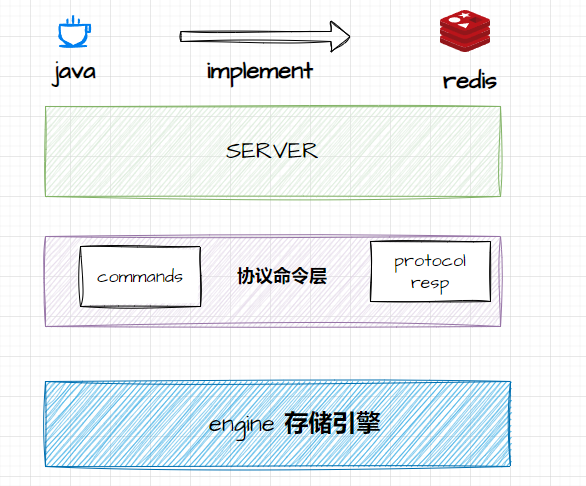
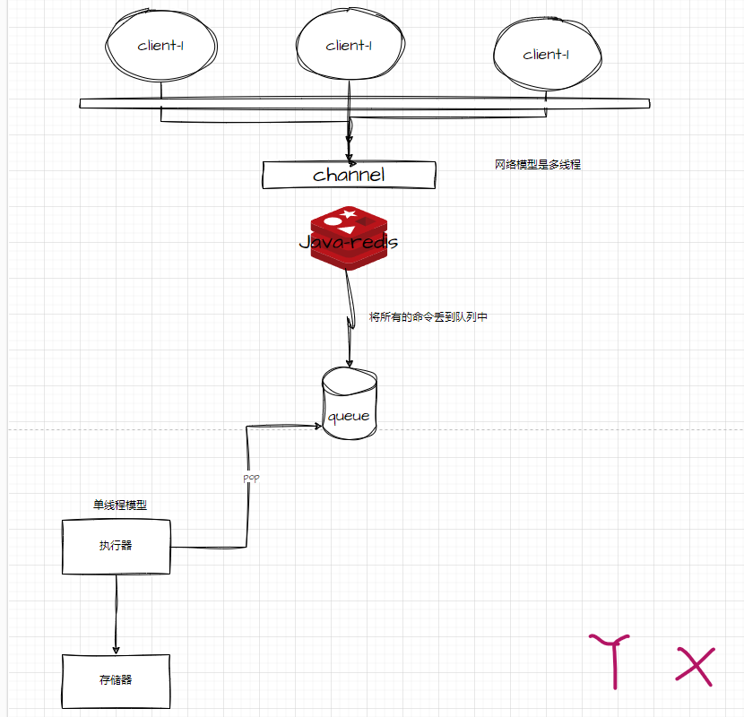

# redis  基于Java实现Redis
## 前述
+ 关于redis作为缓存中间件是后端服务常见常用的缓存中间件，因为是基于C语言开源的，学了redis这么久就有了用golang或者Java实现一个redis的想法，但是网上已经有了golang版本的，所以我想做一个Java版本的redis.
+ 基本上是看着官网进行学习的<a>https://redis.io/docs redis,实现一个简易版本的redis 但是数据结构都会实现已经aof和rdb.

## 架构图

## 简介
+ tcp服务没有采用netty实现，而是采用原生的NIO
+ redis是一个巨大的map，有着频繁扩容和缩容的操作，所以这里并不采用Java自带的HashMap，而是自定义实现的渐进式hash扩容Map
+ 常规数据类型与操作指令支持
  * string：get/mget/set/mset
  * list：lpush/lpop/rpush/rpop/lrange
  * set：sadd/sismember/srem
  * hashmap：hset/hget/hdel
  * sortedset：zadd/zremzrangebyscore 
+ 数据持久化机制
  * aof
  * rdb

## 核心架构流程

## redis理论知识
### 协议RESP
tcp服务器中通信客户端和服务端之前要有一个协议格式(这样服务端才能认识客户端给他发送的数据)，比如常见的http...一系列之类的但是http协议太过于大有一些对于redis来说是一种无效传输。
所以定义了一些协议格式叫RESP.https://redis.io/docs/latest/develop/reference/protocol-spec/#resp-protocol-description
我们主要是做的就是tcp传输数据后，我们拿到数据按照RESP协议来解析这个数据转换成命令即可。这一步最简单的方式就是看官方文档，看一遍不行就两遍。
个人理解就是二进制传输协议
### rdb和aof

